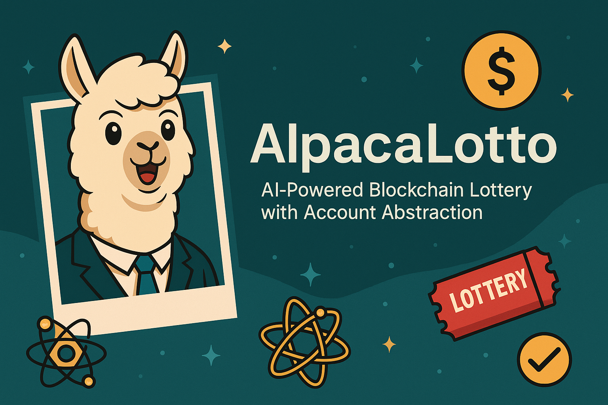

# AlpacaLotto: AI-Powered Blockchain Lottery with Account Abstraction

AlpacaLotto is a next-generation blockchain lottery platform built on NERO Chain that uses Account Abstraction and AI to deliver a seamless, Web2-like experience with powerful Web3 capabilities. Enter lotteries with any token, leverage AI for optimal token selection, and enjoy one-click interactions through session keys.



## Key Features

### 🎟️ Multi-Token Lottery Entry
- Enter lotteries using ANY token in your wallet
- No need to hold native NERO tokens
- Pay lottery tickets and gas with your preferred tokens

### 🤖 AI-Powered Token Optimization
- Advanced algorithm analyzes your tokens to find the most cost-effective option
- Considers balance, volatility, and slippage to optimize your experience
- Automatically recommends the best token for both ticket purchase and gas payment

### 🔑 Session Key Quick Play
- Create temporary session keys for lottery interactions
- Enter multiple lotteries with just one initial signature
- Secure, time-limited keys for frictionless experience

### 🔄 Batched Operations
- Purchase multiple tickets across different lotteries in a single transaction
- Combine ticket purchase and referral rewards in one operation
- Optimize gas costs through bundled UserOperations

### 🛡️ Social Recovery
- Protect lottery winnings with social recovery options
- Designate trusted contacts who can help recover an account
- Enhanced security for high-value prizes

## Technical Stack

### Smart Contracts
- Solidity 0.8.12
- ERC-4337 Account Abstraction
- OpenZeppelin libraries

### Backend
- Node.js
- Express
- ethers.js for blockchain interaction

### Frontend
- React
- React Router
- UserOp SDK for Account Abstraction

## Getting Started

### Prerequisites
- Node.js v16+
- MetaMask or another Web3 wallet
- NERO Chain testnet connection

### Installation

1. Clone the repository:
```bash
git clone https://github.com/WHXisWH/alpaca-lotto.git
cd alpaca-lotto
```

2. Install backend dependencies:
```bash
cd backend
npm install
```

3. Install frontend dependencies:
```bash
cd frontend
npm install
```

### Configuration

1. Create a `.env` file in the backend directory:
```
PORT=3001
NERO_RPC_URL=https://rpc-testnet.nerochain.io
LOTTERY_CONTRACT_ADDRESS=your_contract_address
PAYMASTER_URL=https://paymaster-testnet.nerochain.io
PAYMASTER_API_KEY=your_api_key
ENTRYPOINT_ADDRESS=0x5FF137D4b0FDCD49DcA30c7CF57E578a026d2789
```

2. Create a `.env` file in the frontend directory:
```
REACT_APP_API_BASE_URL=http://localhost:3001/api
REACT_APP_NERO_RPC_URL=https://rpc-testnet.nerochain.io
REACT_APP_BUNDLER_URL=https://bundler-testnet.nerochain.io
REACT_APP_PAYMASTER_URL=https://paymaster-testnet.nerochain.io
REACT_APP_LOTTERY_CONTRACT_ADDRESS=your_contract_address
REACT_APP_PAYMASTER_API_KEY=your_api_key
```

### Running the Application

1. Start the backend:
```bash
cd backend
npm run dev
```

2. Start the frontend:
```bash
cd frontend
npm start
```

3. Open your browser and navigate to `http://localhost:3000`

## Smart Contract Deployment

1. Prepare your deployment private key in a secure file
2. Deploy the AlpacaLotto contract first:
```bash
npx hardhat deploy --network nero-testnet --tags AlpacaLotto
```
3. Deploy supporting contracts:
```bash
npx hardhat deploy --network nero-testnet --tags SessionKeyManager,SocialRecovery
```

## Account Abstraction Features

AlpacaLotto leverages NERO Chain's Account Abstraction capabilities:

### Paymaster Integration
Three payment types are supported:
- **Type 0**: Sponsored Gas (free for users)
- **Type 1**: Prepay with ERC20 tokens
- **Type 2**: Postpay with ERC20 tokens

### Session Keys
Enable temporary, limited permissions for your AA wallet without sharing your private keys. Perfect for repeated lottery entries without constant wallet confirmations.

### Batched Operations
Combine multiple transactions into one to save on gas costs and improve efficiency.

### Social Recovery
Set up guardians who can help you recover your wallet if your keys are lost, ensuring your lottery winnings are always safe.

## AI Token Optimization

Our AI analyzes multiple factors to select the optimal token for gas payment:

- **Balance Analysis**: Ensures you have sufficient tokens for your transaction
- **Volatility Scoring**: Prefers stable tokens to minimize value fluctuations
- **Slippage Evaluation**: Considers liquidity to minimize transaction costs
- **User Preferences**: Takes into account your preferred tokens

The algorithm provides transparent scoring with human-readable explanations for its recommendations.

## Development Roadmap

### 🟦 Wave 2: Core Features (Current)
- Multi-token lottery implementation with ERC20 compatibility
- Session key functionality for gasless repeat participation
- Basic AI token selection for optimal gas costs
- Smart contract security auditing and optimization

### 🟩 Wave 3: Enhanced Features
- Advanced token optimization algorithm based on market conditions
- Social recovery system with guardian designation
- UI/UX refinement for seamless cross-platform experience
- Batch transaction processing for improved efficiency

### 🟪 Wave 4: Ecosystem Expansion
- Cross-chain lottery participation capabilities
- Community governance for lottery parameters
- Loyalty rewards system for frequent players
- Integration with external protocols for expanded prize options

## Contributing

We welcome contributions! Please see our [Contributing Guide](CONTRIBUTING.md) for details.

## License

This project is licensed under the MIT License - see the [LICENSE](LICENSE) file for details.

## Acknowledgements

- NERO Chain team for the AA infrastructure
- Account Abstraction ERC-4337 working group
- All contributors and community members

---

Built with ❤️ for the NERO Chain WaveHack